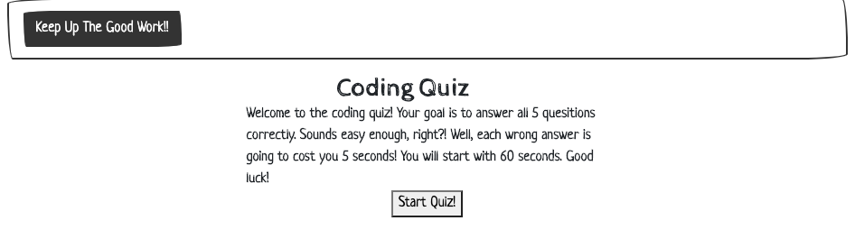
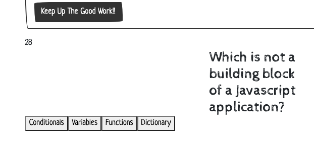
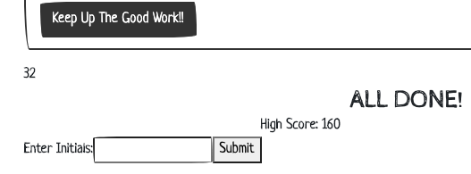
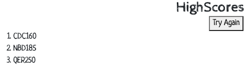

# Code Quiz

Test your knowledge of Javascript!

___

## Description

In this quiz the user will be able to take a 5 question quiz ranging in various concepts covered in Javascript.  The user will be able to select from a choice for four possible answers. Once the correct answer is selected, the page will move on to the next questions with a new set of answers. If the answer is correct, the timer will deduct 5 seconds from what remains of the orignial 60 seconds. Once all 5 questions are answered correctly or the timer reaches 0, the user will be prompted to enter their initials to the high scores page. After the scores are saved, the user will be able try the quiz again to beat their score!

___

## How It Works

The code quiz generator is designed to allow the user the opportunity to test their knowledge of Javascript. Upon entering the website, the user will see a page with instructions for the quiz. 

The user will then click the "Start Quiz" button to begin the quiz. Doing this will also begin a 60 second countdown timer in the upper left hand portion of the screen.

When the questions and answers are displayed, the user will need to answer the questions correctly in order to move onto the next question.  For every incorrect answer given, the timer will be reduced by 5 seconds. The quiz is over when all 5 questions are answered correctly, or when the time hit zero; whichever happens first. Upon completion of the quiz, the user will be taken to a new screen that will calculates the score, (number of seconds remaining * amount of questions answered correctly). From here, they will be prompted to enter their initials for the high score page.

After the user enters their initials, it will be stored in their computer's local storage and add on new scores each time the user plays.

If the user would like to try again, they would just need to click the "Try Again" button to begin the quiz again!
___

## Technologies

- HTML
- CSS
- Bootstrap
- Bootswatch
- Javascript
- Visual Studio Code

___

### License

Copyright 2020 CHELSEY CRAIG

Permission is hereby granted, free of charge, to any person obtaining a copy of this software and associated documentation files (the "Software"), to deal in the Software without restriction, including without limitation the rights to use, copy, modify, merge, publish, distribute, sublicense, and/or sell copies of the Software, and to permit persons to whom the Software is furnished to do so, subject to the following conditions:

The above copyright notice and this permission notice shall be included in all copies or substantial portions of the Software.

THE SOFTWARE IS PROVIDED "AS IS", WITHOUT WARRANTY OF ANY KIND, EXPRESS OR IMPLIED, INCLUDING BUT NOT LIMITED TO THE WARRANTIES OF MERCHANTABILITY, FITNESS FOR A PARTICULAR PURPOSE AND NONINFRINGEMENT. IN NO EVENT SHALL THE AUTHORS OR COPYRIGHT HOLDERS BE LIABLE FOR ANY CLAIM, DAMAGES OR OTHER LIABILITY, WHETHER IN AN ACTION OF CONTRACT, TORT OR OTHERWISE, ARISING FROM, OUT OF OR IN CONNECTION WITH THE SOFTWARE OR THE USE OR OTHER DEALINGS IN THE SOFTWARE.